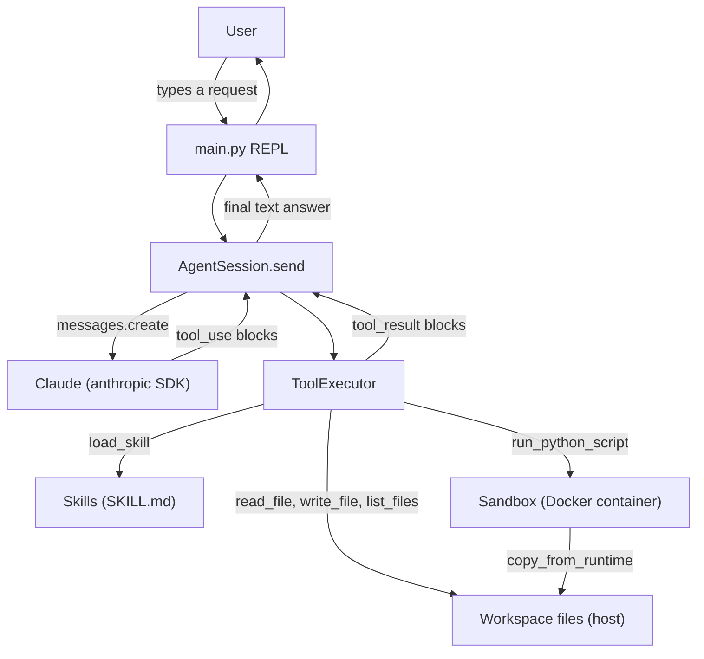

# Jarvis Agent

An interactive command-line chat with Claude.

## Setup

1. Install dependencies:

   ```bash
   pip install -r requirements.txt
   ```

2. Set your Anthropic API key via an environment variable or a `.env` file:

   ```bash
   export ANTHROPIC_API_KEY="your-api-key-here"
   ```

   Or create a `.env` file in the project root:

   ```
   ANTHROPIC_API_KEY=your-api-key-here
   ```

   If both are set, the environment variable takes precedence.

## Usage

Start the chat:

```bash
python -m jarvis_simple_chat
```

Or, equivalently, using the root-level script:

```bash
python jarvis-simple-chat.py
```

Type your message at the `You:` prompt and press Enter to send. Claude's reply is printed after a `Claude:` prefix. Conversation context is preserved across turns.

### Controls

- **Enter** — send your message
- **`exit` or `quit`** — end the session
- **Ctrl+C** — end the session

If `ANTHROPIC_API_KEY` is missing, the program prints an error and exits immediately.

### Demo mode

For presentations or teaching how a chat with an LLM actually works, run with `--demo`:

```bash
python -m jarvis_simple_chat --demo
```

After every reply, this prints two extra panels:

- **Claude API call** — the exact request about to be sent, including the full conversation history resent on every turn (the API itself is stateless).
- **Context after this turn** — the updated history, with the just-appended message flagged, plus a rough token estimate (`chars / 4`).

This makes it visible that "memory" in a chat is just the client resending the whole conversation each time, and that the assistant's own replies become part of the context for the next call.

## Tests

Run the unit tests with:

```bash
python -m unittest discover -s tests
```

## Jarvis Agent (tool-use edition)

`jarvis_agent` is a second, separate agent in this repo. It reads and writes files in a workspace directory and can generate and execute Python scripts inside an isolated Docker sandbox — currently used to generate PDF reports. It's built directly on the `anthropic` client SDK, with no agent framework on top, so the tool-use loop, the sandboxing, and the skill-loading mechanics are all implemented in plain, readable Python for teaching purposes.

### Setup

1. Install dependencies:

   ```bash
   pip install -r requirements.txt
   ```

   This now also installs `llm-sandbox[docker]`, which the agent uses to run generated scripts.

2. Docker must be installed and running locally (Docker Desktop or the Docker Engine) — every `run_python_script` call starts a fresh Docker container, so without a running Docker daemon that tool will fail.

3. Set your `ANTHROPIC_API_KEY` the same way as above (environment variable or `.env` file — see the [Setup](#setup) section for `jarvis_simple_chat`).

### Usage

Start the agent:

```bash
python -m jarvis_agent
```

Or, equivalently, using the root-level script:

```bash
python jarvis-agent.py
```

Files the agent reads, writes, and produces live in `jarvis_agent/workspace/` on the host — this directory is created automatically the first time the package is imported.

Some things to try at the `You:` prompt:

```text
You: Write a file called notes.txt with three bullet points about why sandboxing matters.
You: Now generate a PDF report from the content of notes.txt.
```

The first request is handled with plain file tools. The second one causes the agent to load its `pdf-generation` skill, write a small `reportlab` script, and run it in the Docker sandbox, copying the resulting PDF back into `jarvis_agent/workspace/`.

### Controls

- **Enter** — send your message
- **`exit` or `quit`** — end the session
- **Ctrl+C** — end the session

If `ANTHROPIC_API_KEY` is missing, the program prints an error and exits immediately. API errors and tool/sandbox failures are caught per turn and printed without crashing the REPL.

### Demo mode

For presentations or teaching how this agent actually works, run with `--demo`:

```bash
python -m jarvis_agent --demo
```

At startup, this prints a one-time "Concepts in this demo" banner explaining agents, sandboxes, skills, and MCP in a few lines each. Then, as the agent works on each request, it prints every tool call it makes (the tool name and its arguments) immediately followed by that tool's result (or error) — so you can watch it decide to read a file, load a skill, or run a script inside the sandbox, and see exactly what comes back, before it produces its final reply.

### Concepts: agents, sandboxes, skills, and MCP

This section spells out four terms that come up when explaining `jarvis_agent`, with pointers to where each one lives in the code.

#### What is an agent?

A plain chatbot takes one request and returns one reply — the request/response cycle is over as soon as the model answers. This agent instead runs a *loop*: it asks Claude for a response, and if Claude's response asks for a tool call (`stop_reason == "tool_use"`) instead of giving a final answer, the code runs that tool, feeds the result back to Claude as a new message, and asks again. This repeats — up to a configured step limit — until Claude stops asking for tools and returns a plain text answer.

That loop is `AgentSession.send` in `jarvis_agent/core.py`. Each iteration: call `client.messages.create(...)`, check `stop_reason`, and if it's `tool_use`, execute every requested tool call, append all the results as one `tool_result` message, and go around again.

#### What is a sandbox?

"Sandbox" here means: code the agent writes is never run on the host machine. Every `run_python_script` call spins up a brand-new, isolated Docker container, runs the script inside it, and then throws the container away. The host workspace directory is not mounted into the container at all — the only way files move between the host and the container is explicitly, by name, via `copy_to_runtime` (before the script runs) and `copy_from_runtime` (after it finishes, for any requested output files).

This lives in `jarvis_agent/sandbox.py`, in the `Sandbox.run_script` method, which wraps `llm_sandbox.SandboxSession` configured with `SandboxBackend.DOCKER`.

#### What are skills?

A skill is a small markdown file (`SKILL.md`) containing instructions for how to do one specific kind of task. Rather than pasting every skill's full instructions into the system prompt up front — which would waste context on tasks the current conversation may never touch — the agent only keeps a short catalog entry per skill (its name and one-line description) in the system prompt at startup. That catalog is cheap: it's a couple of lines per skill. Only when the agent decides a skill is actually relevant does it call the `load_skill` tool to pull in the skill's full instructions. This pattern — show a table of contents up front, load details on demand — is called progressive disclosure.

Discovery and loading live in `jarvis_agent/skills.py` (`discover_skills`, `format_skills_catalog`, `load_skill`). The one real skill shipped here is `jarvis_agent/skills/pdf_generation/SKILL.md`, whose instructions tell the agent to write a Python script using `reportlab`, save the output to a path such as `/sandbox/output.pdf`, call `run_python_script` with `libraries=["reportlab"]` so the package gets installed inside the sandbox before the script runs, and list the produced filename in `output_files` so it gets copied back to the workspace.

#### What is MCP (Model Context Protocol)?

MCP is a standardized protocol for connecting an agent to *external* tool servers — for example a shared filesystem server, or a company's internal API server — that can be written in any language and run as their own separate process. An agent speaks MCP to discover and call those tools without either side needing custom integration code for the other.

This agent's tools are the opposite: plain Python functions and classes (`jarvis_agent/tools.py`'s `TOOL_DEFINITIONS` and `ToolExecutor`) wired directly into the loop in the same process. `jarvis_agent` intentionally does not use MCP — it depends only on the `anthropic` client SDK, by design, so that the tool-use loop, sandboxing, and skill-loading are all visible in plain Python rather than hidden behind a framework or protocol layer. MCP is the natural next step if you wanted to plug in tools that other teams build and maintain, without writing Python bindings for them yourself.

#### The loop, visually



### Tests

`jarvis_agent`'s tests live alongside `jarvis_simple_chat`'s in the same `tests/` directory, so the [Tests](#tests) command above (`python -m unittest discover -s tests`) runs both packages' test suites together. All external dependencies (the Anthropic API, Docker/`llm_sandbox`) are faked in these tests — no real network calls or containers are involved in running them.
